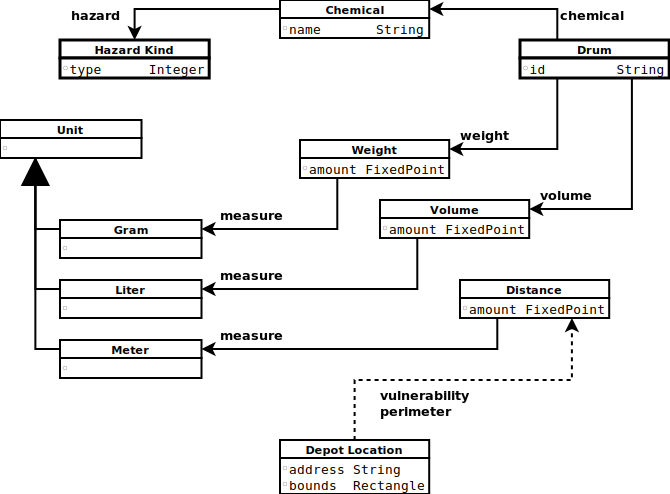

### ECO Depot Hazmat Facility Conceptual Model

This conceptual model is a small sample derived from that discussed more fully [here][model].<br/>
See the [build instructions](BUILDME.md) to rebuild the associated model site and [domain inventory][inventory].

### Overview

Most of the pages and diagrams included in this site were generated automatically by [Syntopica][syntopica-tool] from
a sample [domain model][sample-domain] that was captured using EDUCE.
[EDUCE][educe] is a human-centered process of incremental discovery that captures facts like the following:

```smalltalk
EPA publishes: hazardous chemical storage regulations.
EPA regulates: hazardous chemical storage facilities.
EPA classifies: chemical with: hazard type.

drum storage := storage building stores: drums.
drum storage license permits: drum storage per: hazard type.
EPA issues: drum storage license per: hazard type per: storage building.

```

The results shown herein demonstrate what can be accomplished by combining EDUCE with its companion
conceptual modeling tool [Syntopica][syntopica-tool].
The markdown web pages in [topics](topics) and the SVG [images](images) herein were generated by Syntopica.
The accompanying [domain inventory][inventory] was also generated by [Syntopica][syntopica-tool].

[EDUCE][educe] is an incremental process, and so warrants automation support.
With such automation, visual and textual models can be more easily kept in sync between discovered facts of
the conceptual models and the statements that describe a problem domain.
This was the primary motivation for developing [Syntopica][syntopica-tool].

The [domain model][sample-domain] statements herein emerged from a systematic linguistic analysis of the
[original narrative](#original-narrative).
Thereafter, in addition to the detailed models produced by [Syntopica][syntopica-tool],
simplified [design sketches](#design-sketches) emerged from the analysis, and these were then
used to develop [code sketches](#code-sketches) written in [Hoot Smalltalk][hoot-smalltalk].

### Domain Sketch

A hazardous materials storage facility serves as sample [problem domain](#original-narrative) for consideration,
which has the following key concrete (real world) elements:

![Domain Sketch][domain-sketch]

### Original Narrative

The ECO storage depot operates in accordance with the Environmental Protection Agency (EPA) regulations
controlling the storage of environmentally damaging chemicals.
The ECO depot is only licensed to store drums of chemicals classified as EPA hazard type 1, type 2, or type 3.

The drums are stored in special storage buildings; in the depot there are also buildings that house scientific
and administrative staff. Each storage building is licensed to hold a maximum number of drums.
While the EPA requires that type 1 and type 2 must not be stored in the same building, type 3 can be stored
with either type 1 or type 2.
If either of these regulations is violated, then the EPA will close the depot as unsafe, pending emergency action.

The management has decided to install a computerized system to manage and control the depot.
It is a paramount concern that the system never allow the depot to become unsafe.

The ECO management wants to avoid litigation from their employees or the local council.
They have introduced a company regulation that requires the depot manager be able to monitor the depot and to
always be able to check if the depot is in a vulnerable state.
The regulation states that a depot is vulnerable if any two neighboring buildings contain the maximum number of drums.

When a truck arrives at the loading bay, the clerk enters the manifest accompanying the load and checks in the
drums one at a time. As each drum is checked in, it is assigned an identifier.
Once all the drums have been checked in, any discrepancies between the checked load and the manifest are reported
to the loading bay clerk.
The system then produces a drum-to-building allocation list that says where each drum is to be stored.
The loading bay clerk is notified of any drums that must be returned to the truck because of lack of space.

Drum collections are initiated by the loading bay clerk, who types in an order manifest for the number and
type of drums that are required. The system identifies the drums that are to be retrieved from the storage buildings.
A manifest for the order is sent to the loading bay clerk.

Since there is only one loading bay, it must be empty before a delivery or collection can begin.
It is the clerk’s responsibility to notify the system when the bay is empty.

### Design Sketches

Through application of the [EDUCE process][model], and its domain [analysis][analysis],
the following (simplified) design model sketches emerged from the conceptual model for this sample domain.

<div align="center"><hr/></div>

### Chemical Drum Storage

<div align="center"></div>

<div align="center"><hr/></div>

### Depot Buildings

<div align="center"></div>

<div align="center"><hr/></div>

### Depot Safety

<div align="center"></div>

### Code Sketches

The foregoing design sketches were used to develop [code sketches][code-sketches] written in [Hoot Smalltalk][hoot-smalltalk].
While there were several ordinary [business objects][depot-assets] and [industrial objects][depot-measures] found,
there were also a few [enduring business themes][depot-storage] for this domain:
[Depot Safety][safety-hoot] and [Storage Allocation][allocation-hoot].


[inventory]: domain-inventory.md#eco-hazardous-chemical-storage-depot-domain-inventory
[sample-domain]: briefs/domain-facts.txt#L1
[overview]: images/model-overview.svg

[educe]: https://educery.dev/educe/#educe
[model]: https://educery.dev/educe/domain-example/#copyright
[analysis]: https://educery.dev/educe/domain-example/analysis/#copyright
[notation]: https://educery.dev/papers/software-requirements/#model-key

[domain-sketch]: depot-designs/domain-sketch.png
[depot-safety]: depot-designs/depot-storage.svg
[storage-drums]: depot-designs/storage-drums.svg
[depot-buildings]: depot-designs/depot-buildings.svg
[syntopica-tool]: https://gitlab.com/nikboyd/syntopica/-/tree/master#syntopica
[hoot-smalltalk]: https://gitlab.com/hoot-smalltalk/hoot-smalltalk#hoot-smalltalk

[code-sketches]: depot-models/README.md#eco-depot-model-classes
[depot-assets]: depot-models/src/main/hoot/Com/EcoDepot/Assets/README.md#eco-depot-business-objects
[depot-measures]: depot-models/src/main/hoot/Com/EcoDepot/Measures/README.md#eco-depot-industrial-objects
[depot-storage]: depot-models/src/main/hoot/Com/EcoDepot/Storage/README.md#eco-depot-enduring-business-themes
[safety-hoot]: depot-models/src/main/hoot/Com/EcoDepot/Storage/DepotSafety.hoot#L8
[allocation-hoot]: depot-models/src/main/hoot/Com/EcoDepot/Storage/StorageAllocation.hoot#L8
