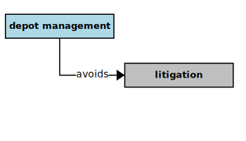
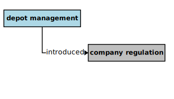

## Depot Management

In the context of this [model](../domain-inventory.md), a [depot management][depot.management]

<ul>
 <li><i>avoids</i> a <a href="litigation.md">litigation</a></li>
 <li> </li>
 <li> </li>
 <li> </li>
 <li> </li>
 <li> </li>
 <li> </li>
 <li> </li>
</ul>

<ul>
 <li><i>introduced</i> a <a href="company.regulation.md">company regulation</a></li>
 <li> </li>
 <li> </li>
 <li> </li>
 <li> </li>
 <li> </li>
 <li> </li>
 <li> </li>
</ul>

### Narrative Source

[Quote:][narrative]
"The ECO management wants to avoid litigation from their employees or the local council.
They have introduced a [company regulation][company.regulation] that requires the [depot manager][depot.manager] be able to monitor the depot
and to always be able to check if the depot is in a vulnerable state.
The regulation states that a depot is vulnerable if any two neighboring buildings contain the maximum number of [drums][drum]."

### Derivations

<table>
<tr><th align="left"> Phrases </th><th align="left"> Derivations </th></tr>
<tr>
<td style="vertical-align:top">

* monitor + ing = monitoring
* vulnerable + ility = **vulnerability**
* [depot monitoring][depot.monitoring] = _monitors_

</td>
<td style="vertical-align:top">

* so: a [company regulation][company.regulation] _requires_ [depot monitoring][depot.monitoring]
*
* and: a [depot manager][depot.manager] _monitors_ the depot _for_ vulnerability

</td>
</tr>
</table>

### Implications

* the ECO management _introduced_ a [company regulation][company.regulation]
* a [company regulation][company.regulation] requires that: a [depot manager][depot.manager] _monitors_ the depot
* a [depot manager][depot.manager] _monitors_ whether the depot is in a vulnerable state

### Mission Themes

* the ECO management wants to _avoid_ litigation

### Definitions

* “building contains the maximum number of [drums][drum]” = **full** storage building
* **full** storage building = storage building drum count _equals_ building [drum storage][drum.storage] limit
* the depot is vulnerable if: any two neighboring [storage buildings][storage.building] are **full**
* neighboring buildings = a storage building _neighbors_ another storage building

[narrative]: ../original-narrative.md#depot-regulation

<b>&sect; &sect; &sect;</b>

[EPA]: EPA.md
[EPAs]: EPA.md
[EPA.regulation]: EPA.regulation.md
[EPA.regulations]: EPA.regulation.md
[building.description]: building.description.md
[building.descriptions]: building.description.md
[chemical.description]: chemical.description.md
[chemical.descriptions]: chemical.description.md
[company.regulation]: company.regulation.md
[company.regulations]: company.regulation.md
[depot]: depot.md
[depots]: depot.md
[depot.building]: depot.building.md
[depot.buildings]: depot.building.md
[depot.distance.unit]: depot.distance.unit.md
[depot.distance.units]: depot.distance.unit.md
[depot.management]: depot.management.md
[depot.managements]: depot.management.md
[depot.management.system]: depot.management.system.md
[depot.management.systems]: depot.management.system.md
[depot.manager]: depot.manager.md
[depot.managers]: depot.manager.md
[depot.map]: depot.map.md
[depot.maps]: depot.map.md
[depot.monitoring]: depot.monitoring.md
[depot.monitorings]: depot.monitoring.md
[depot.volume.unit]: depot.volume.unit.md
[depot.volume.units]: depot.volume.unit.md
[depot.vulnerability]: depot.vulnerability.md
[depot.vulnerabilities]: depot.vulnerability.md
[depot.weight.unit]: depot.weight.unit.md
[depot.weight.units]: depot.weight.unit.md
[drum]: drum.md
[drums]: drum.md
[drum.collection]: drum.collection.md
[drum.collections]: drum.collection.md
[drum.delivery]: drum.delivery.md
[drum.deliveries]: drum.delivery.md
[drum.description]: drum.description.md
[drum.descriptions]: drum.description.md
[drum.identifier]: drum.identifier.md
[drum.identifiers]: drum.identifier.md
[drum.inventory]: drum.inventory.md
[drum.inventories]: drum.inventory.md
[drum.label]: drum.label.md
[drum.labels]: drum.label.md
[drum.storage]: drum.storage.md
[drum.storages]: drum.storage.md
[drum.storage.allocation]: drum.storage.allocation.md
[drum.storage.allocations]: drum.storage.allocation.md
[drum.storage.license]: drum.storage.license.md
[drum.storage.licenses]: drum.storage.license.md
[drum.storage.license.description]: drum.storage.license.description.md
[drum.storage.license.descriptions]: drum.storage.license.description.md
[hazard.type]: hazard.type.md
[hazard.types]: hazard.type.md
[hazardous.chemical]: hazardous.chemical.md
[hazardous.chemicals]: hazardous.chemical.md
[license.inventory]: license.inventory.md
[license.inventories]: license.inventory.md
[loading.bay]: loading.bay.md
[loading.bays]: loading.bay.md
[loading.bay.clerk]: loading.bay.clerk.md
[loading.bay.clerks]: loading.bay.clerk.md
[safety.violation]: safety.violation.md
[safety.violations]: safety.violation.md
[staff.building]: staff.building.md
[staff.buildings]: staff.building.md
[storage.building]: storage.building.md
[storage.buildings]: storage.building.md
[truck]: truck.md
[trucks]: truck.md

