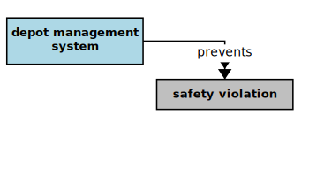
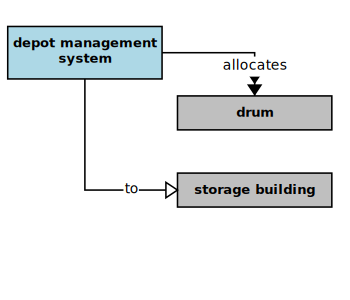

## Depot Management System

In the context of this [model](../domain-inventory.md), a [depot management system][depot.management.system]

<ul>
 <li><i>prevents</i> some <a href="safety.violation.md">safety violations</a></li>
 <li> </li>
 <li> </li>
 <li> </li>
 <li> </li>
 <li> </li>
 <li> </li>
 <li> </li>
</ul>

<ul>
 <li><i>allocates</i> some <a href="drum.md">drums</a> to a <a href="storage.building.md">storage building</a></li>
 <li> </li>
 <li> </li>
 <li> </li>
 <li> </li>
 <li> </li>
 <li> </li>
 <li> </li>
 <li> </li>
 <li> </li>
 <li> </li>
 <li> </li>
 <li> </li>
</ul>

### Narrative Source

[Quote:][narrative]
"The management has decided to install a computerized system to manage and control the depot.
It is a paramount concern that the system never allow the depot to become unsafe."

### Derivations

<table>
<tr><th align="left"> Phrases </th><th align="left"> Derivations </th></tr>
<tr>
<td style="vertical-align:top">

* “never allow” = _prevents_
* “become unsafe” = **safety violation**
* manage + ment = management + system + depot = [depot management system][depot.management.system]

</td>
<td style="vertical-align:top">

*
*
* so: the [depot management system][depot.management.system] _prevents_ a [safety violation][safety.violation]

</td>
</tr>
</table>

### Mission Themes

* the [depot management system][depot.management.system] _prevents_ a [safety violation][safety.violation]

### Additional Concepts

There are holes evident in the original narrative. Many of them were filled during the analysis
through _semantic implication_. However, a few important elements of the domain are still missing.
Also, several [depot management system][depot.management.system] use-cases are implied.
We need to make those use-cases explicit and supply the missing domain elements.

_How does the [depot manager][depot.manager] **manage** the depot?_
* the system presents the available depot management operations to a [depot manager][depot.manager]
* a [depot manager][depot.manager] selects depot status report from the depot management operations
* the system presents a depot status report

_What data does a depot status report provide?_

Each depot status report lists:
* each building that has an [EPA][EPA] [safety violation][safety.violation]
* a building summary for each [storage building][storage.building]
* pairs of vulnerable buildings

A building summary includes:
* a building identifier
* a building [drum storage][drum.storage] limit
* a building [drum inventory][drum.inventory] summary
* a drum count for each stored [hazard type][hazard.type]

_How does the [depot manager][depot.manager] **maintain** [depot building][depot.building] data?_
* a [depot manager][depot.manager] selects building maintenance from the depot management operations

_What are the essential usage cases for the following operations?_
* adding a building – storage / staff
* updating the [drum inventory][drum.inventory] of a [storage building][storage.building]
* removing a building – storage / staff (needed?)

[narrative]: ../original-narrative.md#depot-management

<b>&sect; &sect; &sect;</b>

[EPA]: EPA.md
[EPAs]: EPA.md
[EPA.regulation]: EPA.regulation.md
[EPA.regulations]: EPA.regulation.md
[building.description]: building.description.md
[building.descriptions]: building.description.md
[chemical.description]: chemical.description.md
[chemical.descriptions]: chemical.description.md
[company.regulation]: company.regulation.md
[company.regulations]: company.regulation.md
[depot]: depot.md
[depots]: depot.md
[depot.building]: depot.building.md
[depot.buildings]: depot.building.md
[depot.distance.unit]: depot.distance.unit.md
[depot.distance.units]: depot.distance.unit.md
[depot.management]: depot.management.md
[depot.managements]: depot.management.md
[depot.management.system]: depot.management.system.md
[depot.management.systems]: depot.management.system.md
[depot.manager]: depot.manager.md
[depot.managers]: depot.manager.md
[depot.map]: depot.map.md
[depot.maps]: depot.map.md
[depot.monitoring]: depot.monitoring.md
[depot.monitorings]: depot.monitoring.md
[depot.volume.unit]: depot.volume.unit.md
[depot.volume.units]: depot.volume.unit.md
[depot.vulnerability]: depot.vulnerability.md
[depot.vulnerabilities]: depot.vulnerability.md
[depot.weight.unit]: depot.weight.unit.md
[depot.weight.units]: depot.weight.unit.md
[drum]: drum.md
[drums]: drum.md
[drum.collection]: drum.collection.md
[drum.collections]: drum.collection.md
[drum.delivery]: drum.delivery.md
[drum.deliveries]: drum.delivery.md
[drum.description]: drum.description.md
[drum.descriptions]: drum.description.md
[drum.identifier]: drum.identifier.md
[drum.identifiers]: drum.identifier.md
[drum.inventory]: drum.inventory.md
[drum.inventories]: drum.inventory.md
[drum.label]: drum.label.md
[drum.labels]: drum.label.md
[drum.storage]: drum.storage.md
[drum.storages]: drum.storage.md
[drum.storage.allocation]: drum.storage.allocation.md
[drum.storage.allocations]: drum.storage.allocation.md
[drum.storage.license]: drum.storage.license.md
[drum.storage.licenses]: drum.storage.license.md
[drum.storage.license.description]: drum.storage.license.description.md
[drum.storage.license.descriptions]: drum.storage.license.description.md
[hazard.type]: hazard.type.md
[hazard.types]: hazard.type.md
[hazardous.chemical]: hazardous.chemical.md
[hazardous.chemicals]: hazardous.chemical.md
[license.inventory]: license.inventory.md
[license.inventories]: license.inventory.md
[loading.bay]: loading.bay.md
[loading.bays]: loading.bay.md
[loading.bay.clerk]: loading.bay.clerk.md
[loading.bay.clerks]: loading.bay.clerk.md
[safety.violation]: safety.violation.md
[safety.violations]: safety.violation.md
[staff.building]: staff.building.md
[staff.buildings]: staff.building.md
[storage.building]: storage.building.md
[storage.buildings]: storage.building.md
[truck]: truck.md
[trucks]: truck.md

