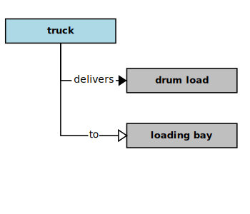

## Drum Delivery

In the context of this [model](../domain-inventory.md), a [drum delivery][drum.delivery]

<ul>
 <li><i>delivers</i> a <a href="drum.load.md">drum load</a> to a <a href="loading.bay.md">loading bay</a></li>
 <li> </li>
 <li> </li>
 <li> </li>
 <li> </li>
 <li> </li>
 <li> </li>
 <li> </li>
 <li> </li>
 <li> </li>
 <li> </li>
 <li> </li>
 <li> </li>
</ul>

### Narrative Source

[Quote:][narrative]
"When a [truck][truck] arrives at the loading bay, the clerk enters the manifest accompanying the load and
checks in the [drums][drum] one at a time. As each drum is checked in, it is assigned an identifier."

### Derivations

<table>
<tr><th align="left"> Phrases </th><th align="left"> Derivations </th></tr>
<tr>
<td style="vertical-align:top">

* When ...
* "manifest accompanying the load"
* "the clerk enters the manifest"
* "checks in the [drums][drum]"
* “is assigned” = _assigns_
*

</td>
<td style="vertical-align:top">

* a [truck][truck] arrives at the loading bay
* a delivery manifest accompanies a drum load
* a [loading bay clerk][loading.bay.clerk] enters a delivery manifest into the system
* a [loading bay clerk][loading.bay.clerk] checks each drum from a drum load
* so: the system _assigns_ a [drum identifier][drum.identifier] _to_ each drum
* and: a [drum identifier][drum.identifier] _identifies_ a drum

</td>
</tr>
</table>

### Implications

* the ECO depot _contains_ a loading bay
* a [truck][truck] _delivers_ a drum load _to_ the loading bay
* a drum load _contains_ [drums][drum]

### Additional Concepts

There are holes evident in the original narrative. Many of them were filled during the analysis
through _semantic implication_. However, a few important elements of the domain are still missing.
Also, several [depot management system][depot.management.system] use-cases are implied.
We need to make those use-cases explicit and supply the missing domain elements.

_What is the nature of a delivery manifest?_
* a delivery manifest lists the drum count for an [EPA][EPA] [hazard type][hazard.type]

_How does the [loading bay clerk][loading.bay.clerk] initiate a delivery?_
* the system presents loading bay operations to a [loading bay clerk][loading.bay.clerk]
* a [loading bay clerk][loading.bay.clerk] selects [drum delivery][drum.delivery] from the loading bay operations
* a [loading bay clerk][loading.bay.clerk] enters a drum count and [EPA][EPA] [hazard type][hazard.type] into the system

_How is a drum identified?_
* a [loading bay clerk][loading.bay.clerk] requests a [drum identifier][drum.identifier] from the system
* the system prints a drum identification label for each drum
* a [loading bay clerk][loading.bay.clerk] attaches a drum identification label to a drum

[narrative]: ../original-narrative.md#drum-delivery

<b>&sect; &sect; &sect;</b>

[EPA]: EPA.md
[EPAs]: EPA.md
[EPA.regulation]: EPA.regulation.md
[EPA.regulations]: EPA.regulation.md
[building.description]: building.description.md
[building.descriptions]: building.description.md
[chemical.description]: chemical.description.md
[chemical.descriptions]: chemical.description.md
[company.regulation]: company.regulation.md
[company.regulations]: company.regulation.md
[depot]: depot.md
[depots]: depot.md
[depot.building]: depot.building.md
[depot.buildings]: depot.building.md
[depot.distance.unit]: depot.distance.unit.md
[depot.distance.units]: depot.distance.unit.md
[depot.management]: depot.management.md
[depot.managements]: depot.management.md
[depot.management.system]: depot.management.system.md
[depot.management.systems]: depot.management.system.md
[depot.manager]: depot.manager.md
[depot.managers]: depot.manager.md
[depot.map]: depot.map.md
[depot.maps]: depot.map.md
[depot.monitoring]: depot.monitoring.md
[depot.monitorings]: depot.monitoring.md
[depot.volume.unit]: depot.volume.unit.md
[depot.volume.units]: depot.volume.unit.md
[depot.vulnerability]: depot.vulnerability.md
[depot.vulnerabilities]: depot.vulnerability.md
[depot.weight.unit]: depot.weight.unit.md
[depot.weight.units]: depot.weight.unit.md
[drum]: drum.md
[drums]: drum.md
[drum.collection]: drum.collection.md
[drum.collections]: drum.collection.md
[drum.delivery]: drum.delivery.md
[drum.deliveries]: drum.delivery.md
[drum.description]: drum.description.md
[drum.descriptions]: drum.description.md
[drum.identifier]: drum.identifier.md
[drum.identifiers]: drum.identifier.md
[drum.inventory]: drum.inventory.md
[drum.inventories]: drum.inventory.md
[drum.label]: drum.label.md
[drum.labels]: drum.label.md
[drum.storage]: drum.storage.md
[drum.storages]: drum.storage.md
[drum.storage.allocation]: drum.storage.allocation.md
[drum.storage.allocations]: drum.storage.allocation.md
[drum.storage.license]: drum.storage.license.md
[drum.storage.licenses]: drum.storage.license.md
[drum.storage.license.description]: drum.storage.license.description.md
[drum.storage.license.descriptions]: drum.storage.license.description.md
[hazard.type]: hazard.type.md
[hazard.types]: hazard.type.md
[hazardous.chemical]: hazardous.chemical.md
[hazardous.chemicals]: hazardous.chemical.md
[license.inventory]: license.inventory.md
[license.inventories]: license.inventory.md
[loading.bay]: loading.bay.md
[loading.bays]: loading.bay.md
[loading.bay.clerk]: loading.bay.clerk.md
[loading.bay.clerks]: loading.bay.clerk.md
[safety.violation]: safety.violation.md
[safety.violations]: safety.violation.md
[staff.building]: staff.building.md
[staff.buildings]: staff.building.md
[storage.building]: storage.building.md
[storage.buildings]: storage.building.md
[truck]: truck.md
[trucks]: truck.md

