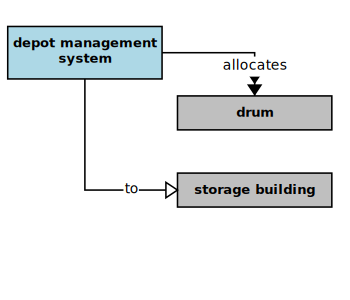

## Drum Storage Allocation

In the context of this [model](../domain-inventory.md), a [drum storage allocation][drum.storage.allocation]

<ul>
 <li><i>allocates</i> some <a href="drum.md">drums</a> to a <a href="storage.building.md">storage building</a></li>
 <li> </li>
 <li> </li>
 <li> </li>
 <li> </li>
 <li> </li>
 <li> </li>
 <li> </li>
 <li> </li>
 <li> </li>
 <li> </li>
 <li> </li>
 <li> </li>
</ul>

### Narrative Source

[Quote:][narrative]
"Once all the [drums][drum] have been checked in, any discrepancies between the checked load and the manifest
are reported to the [loading bay clerk][loading.bay.clerk].
The system then produces a drum-to-building allocation list that says where each drum is to be stored.
The [loading bay clerk][loading.bay.clerk] is notified of any [drums][drum] that must be returned to the [truck][truck] because of lack of space."

### Derivations

* a [loading bay clerk][loading.bay.clerk] checks all the [drums][drum]
* the system reports any discrepancies to a [loading bay clerk][loading.bay.clerk]
* the system produces a drum-to-building allocation list
* a drum-to-building allocation list says in which [storage building][storage.building] to store each drum
* the system notifies a [loading bay clerk][loading.bay.clerk] of any returned [drums][drum]

### Implications

* a [loading bay clerk][loading.bay.clerk] notifies the system of a checked drum load
* the system produces a discrepancy report for a [loading bay clerk][loading.bay.clerk]
* the system produces a drum allocation report for a [loading bay clerk][loading.bay.clerk]
* a drum storage allocation report lists the [drum storage allocations][drum.storage.allocation] for a drum load
* a drum storage allocation identifies the [storage building][storage.building] for each accepted drum
* the system allocates some [drums][drum] to a [storage building][storage.building]
* the system produces a returned drum report for a [loading bay clerk][loading.bay.clerk]

### Additional Concepts

There are holes evident in the original narrative. Many of them were filled during the analysis
through _semantic implication_. However, a few important elements of the domain are still missing.
Also, several [depot management system][depot.management.system] use-cases are implied.
We need to make those use-cases explicit and supply the missing domain elements.

_What is a discrepancy?_
* a discrepancy exists when a checked load drum count does not match the delivery manifest drum count

A discrepancy report lists:
* the drum load [EPA][EPA] [hazard type][hazard.type]
* the checked load drum count
* the delivery manifest drum count
* difference between them

_What is a returned drum report?_

A returned drum report lists:
* the drum load [EPA][EPA] [hazard type][hazard.type]
* the returned drum count

[narrative]: ../original-narrative.md#drum-storage-allocation

<b>&sect; &sect; &sect;</b>

[EPA]: EPA.md
[EPAs]: EPA.md
[EPA.regulation]: EPA.regulation.md
[EPA.regulations]: EPA.regulation.md
[building.description]: building.description.md
[building.descriptions]: building.description.md
[chemical.description]: chemical.description.md
[chemical.descriptions]: chemical.description.md
[company.regulation]: company.regulation.md
[company.regulations]: company.regulation.md
[depot]: depot.md
[depots]: depot.md
[depot.building]: depot.building.md
[depot.buildings]: depot.building.md
[depot.distance.unit]: depot.distance.unit.md
[depot.distance.units]: depot.distance.unit.md
[depot.management]: depot.management.md
[depot.managements]: depot.management.md
[depot.management.system]: depot.management.system.md
[depot.management.systems]: depot.management.system.md
[depot.manager]: depot.manager.md
[depot.managers]: depot.manager.md
[depot.map]: depot.map.md
[depot.maps]: depot.map.md
[depot.monitoring]: depot.monitoring.md
[depot.monitorings]: depot.monitoring.md
[depot.volume.unit]: depot.volume.unit.md
[depot.volume.units]: depot.volume.unit.md
[depot.vulnerability]: depot.vulnerability.md
[depot.vulnerabilities]: depot.vulnerability.md
[depot.weight.unit]: depot.weight.unit.md
[depot.weight.units]: depot.weight.unit.md
[drum]: drum.md
[drums]: drum.md
[drum.collection]: drum.collection.md
[drum.collections]: drum.collection.md
[drum.delivery]: drum.delivery.md
[drum.deliveries]: drum.delivery.md
[drum.description]: drum.description.md
[drum.descriptions]: drum.description.md
[drum.identifier]: drum.identifier.md
[drum.identifiers]: drum.identifier.md
[drum.inventory]: drum.inventory.md
[drum.inventories]: drum.inventory.md
[drum.label]: drum.label.md
[drum.labels]: drum.label.md
[drum.storage]: drum.storage.md
[drum.storages]: drum.storage.md
[drum.storage.allocation]: drum.storage.allocation.md
[drum.storage.allocations]: drum.storage.allocation.md
[drum.storage.license]: drum.storage.license.md
[drum.storage.licenses]: drum.storage.license.md
[drum.storage.license.description]: drum.storage.license.description.md
[drum.storage.license.descriptions]: drum.storage.license.description.md
[hazard.type]: hazard.type.md
[hazard.types]: hazard.type.md
[hazardous.chemical]: hazardous.chemical.md
[hazardous.chemicals]: hazardous.chemical.md
[license.inventory]: license.inventory.md
[license.inventories]: license.inventory.md
[loading.bay]: loading.bay.md
[loading.bays]: loading.bay.md
[loading.bay.clerk]: loading.bay.clerk.md
[loading.bay.clerks]: loading.bay.clerk.md
[safety.violation]: safety.violation.md
[safety.violations]: safety.violation.md
[staff.building]: staff.building.md
[staff.buildings]: staff.building.md
[storage.building]: storage.building.md
[storage.buildings]: storage.building.md
[truck]: truck.md
[trucks]: truck.md

