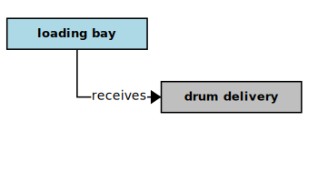

## Loading Bay

In the context of this [model](../domain-inventory.md), a [loading bay][loading.bay]

<ul>
 <li><i>receives</i> a <a href="drum.delivery.md">drum delivery</a></li>
 <li> </li>
 <li> </li>
 <li> </li>
 <li> </li>
 <li> </li>
 <li> </li>
 <li> </li>
</ul>

### Narrative Source

[Quote:][narrative]
"Since there is only one loading bay, it must be empty before a delivery or collection can begin.
It is the clerk’s responsibility to notify the system when the bay is empty."

### Derivations

* the ECO depot contains only one loading bay
* the loading bay must be empty before a delivery can begin
* the loading bay must be empty before a collection can begin
* a [loading bay clerk][loading.bay.clerk] must notify the system when the loading bay is empty

### Preconditions

* a [drum delivery][drum.delivery] can begin only if the loading bay is empty
* a [drum collection][drum.collection] can begin only if the loading bay is empty

### Implications

* a [loading bay clerk][loading.bay.clerk] notifies the system when the loading bay is empty

### Additional Concepts

There are holes evident in the original narrative. Many of them were filled during the analysis
through _semantic implication_. However, a few important elements of the domain are still missing.
Also, several [depot management system][depot.management.system] use-cases are implied.
We need to make those use-cases explicit and supply the missing domain elements.

_Who unloads the [drums][drum] from a [truck][truck] in the loading bay?_
* a drum handler transfers delivered [drums][drum] from a [truck][truck] into the loading bay

_What happens to the returned [drums][drum]?_
* a drum handler returns [drums][drum] from the loading bay onto a [truck][truck]

_How are the [drums][drum] collected?_
* a [loading bay clerk][loading.bay.clerk] gives a collection manifest to a drum handler
* a drum handler collects [drums][drum] from the [storage buildings][storage.building] into the loading bay
* a drum handler transfers the collected [drums][drum] from the loading bay onto the [truck][truck]
* a [truck][truck] collects a drum load from the loading bay

[narrative]: ../original-narrative.md#loading-bay

<b>&sect; &sect; &sect;</b>

[EPA]: EPA.md
[EPAs]: EPA.md
[EPA.regulation]: EPA.regulation.md
[EPA.regulations]: EPA.regulation.md
[building.description]: building.description.md
[building.descriptions]: building.description.md
[chemical.description]: chemical.description.md
[chemical.descriptions]: chemical.description.md
[company.regulation]: company.regulation.md
[company.regulations]: company.regulation.md
[depot]: depot.md
[depots]: depot.md
[depot.building]: depot.building.md
[depot.buildings]: depot.building.md
[depot.distance.unit]: depot.distance.unit.md
[depot.distance.units]: depot.distance.unit.md
[depot.management]: depot.management.md
[depot.managements]: depot.management.md
[depot.management.system]: depot.management.system.md
[depot.management.systems]: depot.management.system.md
[depot.manager]: depot.manager.md
[depot.managers]: depot.manager.md
[depot.map]: depot.map.md
[depot.maps]: depot.map.md
[depot.monitoring]: depot.monitoring.md
[depot.monitorings]: depot.monitoring.md
[depot.volume.unit]: depot.volume.unit.md
[depot.volume.units]: depot.volume.unit.md
[depot.vulnerability]: depot.vulnerability.md
[depot.vulnerabilities]: depot.vulnerability.md
[depot.weight.unit]: depot.weight.unit.md
[depot.weight.units]: depot.weight.unit.md
[drum]: drum.md
[drums]: drum.md
[drum.collection]: drum.collection.md
[drum.collections]: drum.collection.md
[drum.delivery]: drum.delivery.md
[drum.deliveries]: drum.delivery.md
[drum.description]: drum.description.md
[drum.descriptions]: drum.description.md
[drum.identifier]: drum.identifier.md
[drum.identifiers]: drum.identifier.md
[drum.inventory]: drum.inventory.md
[drum.inventories]: drum.inventory.md
[drum.label]: drum.label.md
[drum.labels]: drum.label.md
[drum.storage]: drum.storage.md
[drum.storages]: drum.storage.md
[drum.storage.allocation]: drum.storage.allocation.md
[drum.storage.allocations]: drum.storage.allocation.md
[drum.storage.license]: drum.storage.license.md
[drum.storage.licenses]: drum.storage.license.md
[drum.storage.license.description]: drum.storage.license.description.md
[drum.storage.license.descriptions]: drum.storage.license.description.md
[hazard.type]: hazard.type.md
[hazard.types]: hazard.type.md
[hazardous.chemical]: hazardous.chemical.md
[hazardous.chemicals]: hazardous.chemical.md
[license.inventory]: license.inventory.md
[license.inventories]: license.inventory.md
[loading.bay]: loading.bay.md
[loading.bays]: loading.bay.md
[loading.bay.clerk]: loading.bay.clerk.md
[loading.bay.clerks]: loading.bay.clerk.md
[safety.violation]: safety.violation.md
[safety.violations]: safety.violation.md
[staff.building]: staff.building.md
[staff.buildings]: staff.building.md
[storage.building]: storage.building.md
[storage.buildings]: storage.building.md
[truck]: truck.md
[trucks]: truck.md

