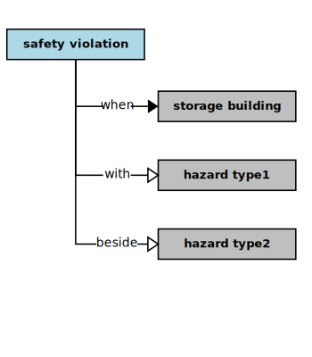

## Safety Violation

In the context of this [model](../domain-inventory.md), a [safety violation][safety.violation]

<ul>
 <li><i>equals</i> an <a href="EPA.safety.violation.md">EPA safety violation</a></li>
 <li> </li>
 <li> </li>
 <li> </li>
 <li> </li>
 <li> </li>
 <li> </li>
 <li> </li>
</ul>

<ul>
 <li><i>when</i> a <a href="storage.building.md">storage building</a> with an <a href="hazard.type1.md">hazard type1</a> beside an <a href="hazard.type2.md">hazard type2</a></li>
 <li> </li>
 <li> </li>
 <li> </li>
 <li> </li>
 <li> </li>
 <li> </li>
 <li> </li>
 <li> </li>
 <li> </li>
 <li> </li>
 <li> </li>
 <li> </li>
 <li> </li>
 <li> </li>
 <li> </li>
</ul>

### Narrative Source

[Quote:][narrative]
"While the [EPA][EPA] requires that type 1 and type 2 must not be stored in the same building,
type 3 can be stored with either type 1 or type 2.
If either of these regulations is violated, then the [EPA][EPA] will close the [depot][depot] as unsafe, pending emergency action."

### Derivations

<table>
<tr><th align="left"> Phrases </th><th align="left"> Derivations </th></tr>
<tr>
<td style="vertical-align:top">

* “stored” = _stores_
* unsafe – un + ty = safety
* complies – s + ance = safety compliance
* violated – ed + ion = [safety violation][safety.violation]

</td>
<td style="vertical-align:top">

* so: a building _stores_ type 1, type 2, or type 3
* so: the [EPA][EPA] publishes safety regulations
* so: the [EPA][EPA] requires safety compliance
* so: a safety regulation defines [safety violation][safety.violation]

</td>
</tr>
</table>

### Implications

* the [EPA][EPA] will close the [depot][depot] if a [safety violation][safety.violation] occurs
* the [EPA][EPA] will reopen the [depot][depot] only after the [depot][depot] restores safety compliance
* a [depot][depot] closure thereafter requires emergency corrective action by the [depot][depot]

### Compliance

* safety compliance exists if a building that stores type 3 also stores type 1
* safety compliance exists if a building that stores type 3 also stores type 2
* a [safety violation][safety.violation] exists if a building that stores type 1 also stores type 2

[narrative]: ../original-narrative.md#depot-safety

<b>&sect; &sect; &sect;</b>

[EPA]: EPA.md
[EPAs]: EPA.md
[EPA.regulation]: EPA.regulation.md
[EPA.regulations]: EPA.regulation.md
[building.description]: building.description.md
[building.descriptions]: building.description.md
[chemical.description]: chemical.description.md
[chemical.descriptions]: chemical.description.md
[company.regulation]: company.regulation.md
[company.regulations]: company.regulation.md
[depot]: depot.md
[depots]: depot.md
[depot.building]: depot.building.md
[depot.buildings]: depot.building.md
[depot.distance.unit]: depot.distance.unit.md
[depot.distance.units]: depot.distance.unit.md
[depot.management]: depot.management.md
[depot.managements]: depot.management.md
[depot.management.system]: depot.management.system.md
[depot.management.systems]: depot.management.system.md
[depot.manager]: depot.manager.md
[depot.managers]: depot.manager.md
[depot.map]: depot.map.md
[depot.maps]: depot.map.md
[depot.monitoring]: depot.monitoring.md
[depot.monitorings]: depot.monitoring.md
[depot.volume.unit]: depot.volume.unit.md
[depot.volume.units]: depot.volume.unit.md
[depot.vulnerability]: depot.vulnerability.md
[depot.vulnerabilities]: depot.vulnerability.md
[depot.weight.unit]: depot.weight.unit.md
[depot.weight.units]: depot.weight.unit.md
[drum]: drum.md
[drums]: drum.md
[drum.collection]: drum.collection.md
[drum.collections]: drum.collection.md
[drum.delivery]: drum.delivery.md
[drum.deliveries]: drum.delivery.md
[drum.description]: drum.description.md
[drum.descriptions]: drum.description.md
[drum.identifier]: drum.identifier.md
[drum.identifiers]: drum.identifier.md
[drum.inventory]: drum.inventory.md
[drum.inventories]: drum.inventory.md
[drum.label]: drum.label.md
[drum.labels]: drum.label.md
[drum.storage]: drum.storage.md
[drum.storages]: drum.storage.md
[drum.storage.allocation]: drum.storage.allocation.md
[drum.storage.allocations]: drum.storage.allocation.md
[drum.storage.license]: drum.storage.license.md
[drum.storage.licenses]: drum.storage.license.md
[drum.storage.license.description]: drum.storage.license.description.md
[drum.storage.license.descriptions]: drum.storage.license.description.md
[hazard.type]: hazard.type.md
[hazard.types]: hazard.type.md
[hazardous.chemical]: hazardous.chemical.md
[hazardous.chemicals]: hazardous.chemical.md
[license.inventory]: license.inventory.md
[license.inventories]: license.inventory.md
[loading.bay]: loading.bay.md
[loading.bays]: loading.bay.md
[loading.bay.clerk]: loading.bay.clerk.md
[loading.bay.clerks]: loading.bay.clerk.md
[safety.violation]: safety.violation.md
[safety.violations]: safety.violation.md
[staff.building]: staff.building.md
[staff.buildings]: staff.building.md
[storage.building]: storage.building.md
[storage.buildings]: storage.building.md
[truck]: truck.md
[trucks]: truck.md

